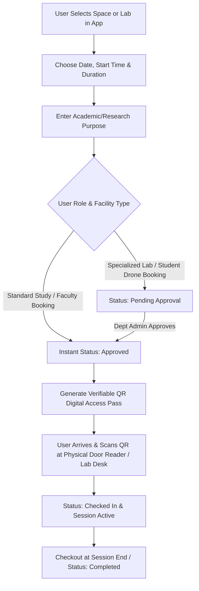

# Bannari Amman Institute of Technology - Facility & Space Booking Rules & SOPs

This document defines the complete standard operating procedures (SOPs), role-based permissions, automated approval workflows, and digital pass verification systems for booking campus rooms, labs, seminar halls, and equipment.

---

## 1. Role-Based Access & Booking Entitlements

| User Role | Booking Capabilities | Approval Workflow | Auto-Approval Limits | Active Simultaneous Bookings |
|---|---|---|---|---|
| **Student** (`Student`) | Classrooms, Study Pods, Labs, Standard Equipment (Laptops, 3D Printers) | Requires Faculty Mentor / Lab In-Charge review for high-value labs | Auto-approved for library pods & study rooms up to 3 hours | Max 2 active bookings |
| **Faculty** (`Faculty`) | All Classrooms, Seminar Halls, Research Labs, Drones, High-End Workstations | Instant Auto-Approval for academic purposes | Auto-approved up to 8 hours | Max 5 active bookings |
| **Administrator** (`Administrator`)| All 428 rooms, VIP convention halls, audit trails, system override | Super-admin instant override | Unlimited | Unlimited |

---

## 2. Space Booking Step-by-Step Workflow

---

## 3. Instant Digital Access Pass (QR Code Verification)
- When a booking is confirmed, the system generates a unique encrypted QR Token formatted as `CAMPUS-BOOKING-{ID}-{USER_HASH}`.
- **Smart Door Access:** Equipped seminar halls and computer labs feature RFID & Optical QR scanners at entrance doors. Scanning the mobile screen unlocks magnetic doors.
- **Offline Mode:** The mobile app caches the signed QR pass locally so users can access facilities even without active cellular connection.

---

## 4. Check-In & Auto-Release Policy (Ghost Booking Prevention)
- **15-Minute Grace Window:** The user must scan in at the venue within **15 minutes** of the reserved start time.
- **Auto-Cancellation:** If no check-in occurs after 15 minutes, the reservation is marked as `No-Show`, the booking is cancelled, and the space is immediately returned to the public pool as `Available`.
- **Three-Strike Policy:** Users accumulating 3 `No-Show` infractions within a semester face a 14-day reservation lock.

---

## 5. Cancellation & Modification Policies
- **Free Cancellation:** Bookings can be cancelled up to **30 minutes** before the start time with zero penalty.
- **Early Checkout:** If finishing early, users are encouraged to tap **"End Session"** in the app to release the room/asset for fellow campus members.
- **Extensions:** If the succeeding time slot is vacant, a 1-hour extension can be requested directly via the active booking screen.

---

## 6. Hall & Lab Reservation Guidelines
1. **Academic Classrooms:** Open for student study groups between 05:00 PM and 08:30 PM on weekdays and 08:00 AM - 06:00 PM on Saturdays.
2. **Seminar Halls & Auditoriums:** Require event poster or faculty sponsor approval; bookings must be submitted at least 24 hours prior.
3. **High-Power Computing Labs (AI Lab / HPC):** Background jobs requiring overnight batch processing must be declared in the booking purpose.
4. **Cleanliness & Food Policy:** No food or sugary beverages permitted inside computing labs or seminar halls; water bottles with sealed caps permitted.
